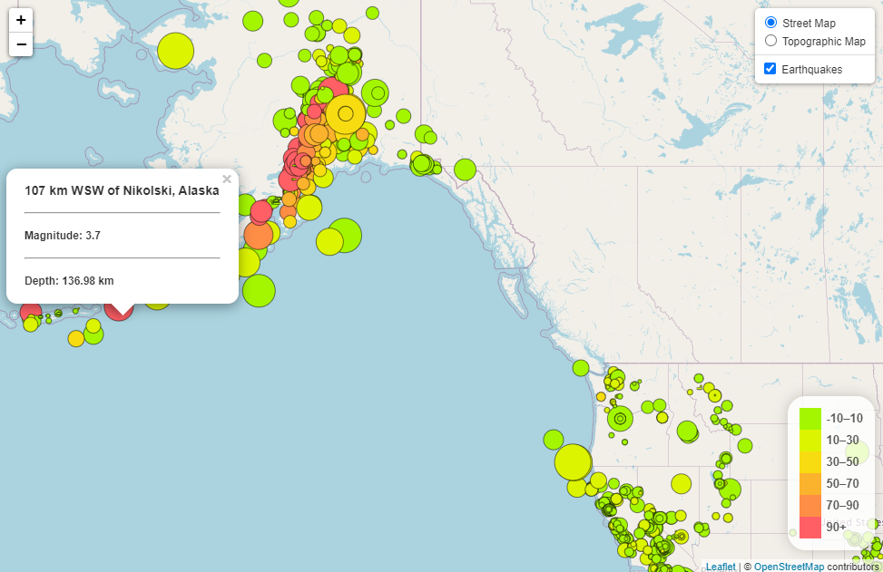

# Earthquake-Analysis
***
## Overview
This application pulls data from the [USGS GeoJSON Feed page](https://earthquake.usgs.gov/earthquakes/feed/v1.0/geojson.php), where earthquake activity is updated every 5 minutes. Each data marker reflects the magnitude of the earthquake by the bubble size and the depth is indicated by the color. The user may select an individual bubble to display a tooltip with the earthquakes location, magnitude, and depth.

